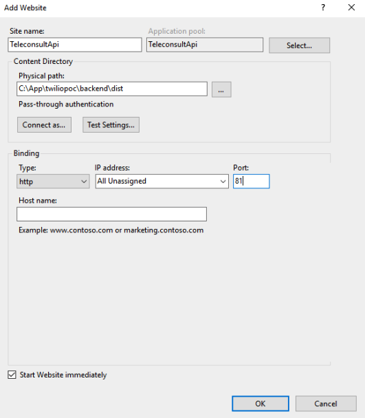

# Deploy Application On Windows Server Guide

This guide will help you deploy the application to Windows Server 2019.

We will deploy both backend & frontend to single instance:

  * Backend: NestJS run on port 81.
  * Frontend: ReactJS run on port 80.

## Launch Instance

First of all, please launch a Windows Server AWS EC2 instance (recommend to use instance with 4GB of RAM like `t2.medium`). Windows Server use too much freaking RAM, if we use too small instance it can not build nodejs source because of memory leak problem.

To connect to the instance you can use `Microsoft Remote Deskto‪p‬` app:

  * [Install Microsoft Remote Deskto‪p On MacOS](https://apps.apple.com/us/app/microsoft-remote-desktop/id1295203466)

Notes:

  * Use Windows PowerShell instead of Command Prompt for better command systems
  * Use Google Chrome instead of Internet Explorer to prevent unexpected issues
  * Use VSCode when edit source code or adding .env file

## Install Common Tools

Connect to the instance and install these tools:

  * [Google Chrome](https://www.google.com/intl/en/chrome/)
  * [VSCode](https://code.visualstudio.com/download)
  * [NodeJS](https://nodejs.org/en/download)
  * [Git](https://git-scm.com/downloads)

## Install PostgreSQL Database

Please follow this guide to install Postgres [https://www.guru99.com/download-install-postgresql.html](https://www.guru99.com/download-install-postgresql.html).

  * Host: `localhost`
  * Port: `5432`
  * Username: `postgres`
  * Password: `secretPwd123`

After Postgres installed, go to `pgAdmin 4` tool to create new database name `teleconsult`.

## Install Redis Cache

Please follow this guide install Redis Cache [https://gaopengbai0121.medium.com/install-and-configure-redis-on-window-6326b801ba06](https://gaopengbai0121.medium.com/install-and-configure-redis-on-window-6326b801ba06).

  * Host: `localhost`
  * Port: `6379`

## Install PM2 NodeJS Process Manager

```
  npm install -g pm2@latest
```

[Please read pm2 document to learn more](https://www.npmjs.com/package/pm2). At least you must know these commands:

  * `list`
  * `start`
  * `stop`
  * ...

## Start Backend Server

- Clone source code to: `C:\App\twiliopoc`
- Go to backend dir: `cd C:\App\twiliopoc\backend`
- Install node modules: `npm install`
- Add `.env` in root of `cd C:\App\twiliopoc\backend`, it must include these environment variables

```
  CLIENT_ORIGIN=http://52.221.143.23 # Your instance public IP address with default port 80
  ORIGIN=http://52.221.143.23:81 # Your instance public IP address with port 81
  PORT=5001
  TZ=UTC

  JWT_SECRET=secret
  BCRYPT_SALT_ROUNDS=10

  TYPEORM_CONNECTION=postgres
  TYPEORM_HOST=localhost
  TYPEORM_USERNAME=postgres
  TYPEORM_PASSWORD=secretPwd123
  TYPEORM_DATABASE=teleconsult
  TYPEORM_PORT=5432
  TYPEORM_SYNCHRONIZE=false
  TYPEORM_LOGGING=true
  TYPEORM_ENTITIES=dist/**/*.entity.js
  TYPEORM_MIGRATIONS=dist/typeorm/migrations/*.js
  TYPEORM_SEEDING_SEEDS=dist/typeorm/seeds/**/*.js
  TYPEORM_MIGRATIONS_DIR=dist/typeorm/migrations
  TYPEORM_DRIVER_EXTRA='{"ssl": false}'

  REDIS_HOST=localhost
  REDIS_PORT=6379
  REDIS_DB=0
  REDIS_PASSWORD=

  MAIL_HOST=smtp.sendgrid.net
  MAIL_PORT=587
  MAIL_USER=apikey
  MAIL_PASSWORD=
  MAIL_FROM="Teleconsult <test@gmail.com>"

  TWILIO_ACCOUNT_SID=
  TWILIO_AUTH_TOKEN=
  TWILIO_API_KEY=
  TWILIO_API_SECRET=
```

- Build source: `npm run build`
- Run database migrations: `npm run typeorm migration:run`
- Run database seeds: `npm run seed:run`
- Start the server: `pm2 start .\dist\main`
- Backend api is served on `http://localhost:5001`

## Start Frontend Server

- Go to frontend dir: `cd C:\App\twiliopoc\frontend`
- Install node modules: `npm install`
- Add `.env` in root of `cd C:\App\twiliopoc\frontend`, it must include these environment variables

```
  REACT_APP_API_HOST=http://52.221.143.23:81 # Your instance public IP address with port 81
  REACT_APP_HOST=http://52.221.143.23 # Your instance public IP address with default port 80
```

- Build source: `npm run build`
- Start the server: `pm2 start server.js`
- Frontend is served on `http://localhost:5000`

## Install Internet Information Services (IIS)

Please follow this guide to install IIS [https://www.rootusers.com/how-to-install-iis-in-windows-server-2019/](https://www.rootusers.com/how-to-install-iis-in-windows-server-2019).

Install `URL Rewrite` module:

  * Go to [https://www.iis.net/downloads/microsoft/url-rewrite](https://www.iis.net/downloads/microsoft/url-rewrite).
  * Click `Install this extension`. It will open the `Web Platform Installer` start initiating.
  * Press `Install` and `I Accept`.

## Setup IIS For The Application

### 1. Default Web Site - Port 80 - Frontend ReactJS
  - Open IIS Manager.

    

  - Go to `Default Web Site`, double click on `URL Rewrite`.

    

  - Click on `Add Rule(s)` in the top right-side corner.

    

    * Click on `Reverse Proxy`, it will prompt you to a new `Reverse Proxy Rule`. This will open the `Web Platform Installer` again and will ask you to install a module called `Application Request Routing`.

      

    * Click `Yes` to install it.

  - Now we are done with installing all the configurations required. The last step would be adding the `Server name or IP address where HTTP requests will be forwarded`. Add the value as `localhost:<port number>`. In our scenario, it should be `localhost:5000` - The `Default Web Site` will bind `localhost:80` to `localhost:5000` to serve frontend reactjs application.

    

  - Press `OK`, we are done with IIS for frontend app.
  - Send http request to `http://localhost` to check, it must have same response as `http://localhost:5000`.

### 2. TeleconsultApi - Port 81 - Backend Api NestJs
  - Open IIS Manager.
  - On left menu, right click on `Site` and `Add Website`.

    

  - Fill all information for the new website.

    

    * Sitemame: `TeleconsultApi`
    * Physical Path: `C:\App\twiliopoc\backend\dist`
    * Port: `81` (Must not be `80` - because it is used for frontend)

  - Click `OK` to submit.
  - Go to `TeleconsultApi`, double click on `URL Rewrite`.

    

  - Click on `Add Rule(s)` in the top right-side corner, click on `Reverse Proxy` then `OK`.

    

  - Set inbound rules to `localhost:5001` - The `TeleconsultApi` will bind `localhost:81` to `localhost:5001` to serve backend api nestjs application.

    

  - Press `OK`. We are done with IIS for backend app.
  - Send http request to `http://localhost:81` to check, it must have same response as `http://localhost:5001`.

## Public Port 81 In Windows Server

For some security problem, Windows Server only public port 80 to access from outside. So to make backend api work, we need to public port 81 also.

- Open `Server Manager` application.

  

- Click on `Local Server`, then click on `Private: On`.

  

- Click on `Advanced settings`.

  

- In left menu, click on `Inbound Rules`, then click on `New Rule`.

  

- In `Rule Type` step, select `Port`, then `Next`.

  

- In `Protocol and Ports` step, select `TCP` and set `Specific local ports` to `81`, then `Next`.

  

- In `Action` step, select `Allow the connection`, then `Next`.

  

- In `Profile` step, select all, then `Next`.

  

- In `Name` step, give name for the rule, then `Finish`.

  

## Public Port 80 and 81 In AWS EC2

In AWS EC2 Console, go to the `Security Group` of the instance, edit `Inbound Rules`, then `Save rules`.
  

After `Save rules`, you can visit `http://52.221.143.23` (Your instance public IP address) from web browser to check the application.

For admin dashboard, visit `http://52.221.143.23/admin`, login with this admin credentials: `admin@gmail.com/password123`.

## Summary

Above are all steps to deploy teleconsult application to Windows Server 2019.

For better infrastructure, i suggest to have these changes:

  * Use Ubuntu + Nginx instead of Windows Server + IIS
  * Use AWS RDS for Postgres Database
  * Use Amazon ElastiCache for Redis
